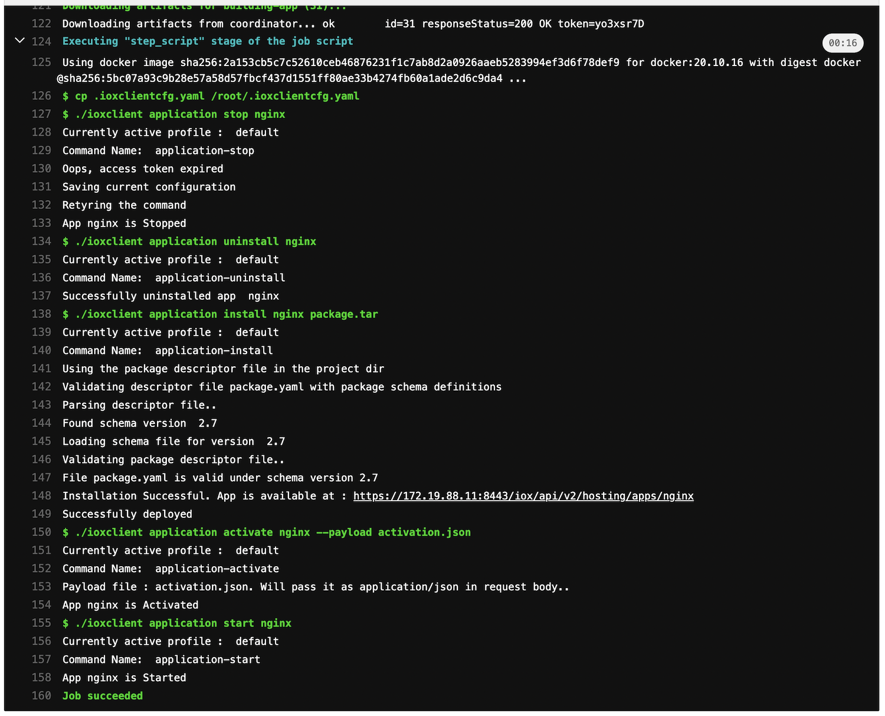

# Gitlab CI/CD Pipeline for IOx Applications

This is a small example of how an CI/CD pipeline with IOx and Gitlab can look like.

## Install Gitlab

Copy both files from the install folder. Make the shell script executable and run it. Gitlab and gitlab runner should be up and running.

More Information: [https://blogs.cisco.com/developer/gitlabcicdpipelines02](https://developer.cisco.com/docs/iox/#!iox-resource-downloads)

## Create Pipeline

1. Run ioxclient the first time and create the profile of your device. This will create the file ``.ioxclientcfg.yaml`` in your user's home folder.

> Be aware that the executable of ioxclient in this repo is Linux based. Find others here: [https://developer.cisco.com/docs/iox/#!iox-resource-downloads ](https://developer.cisco.com/docs/iox/#!iox-resource-downloads)

2. Replace the file `.ioxclientcfg.yaml` from this repo.

3. Change the `activation.json` file according (IOx application network settings).

3. Copy all files to a git repo within your newly created gitlab project.

4. The pipeline should run automatically and the latest version should be pushed directly to your device.

### Limitations

The auth_token is only limited for a certain time. You could create a shell script which automatically renews the token once the application will be pushed.

## License

This project is licensed under the MIT license - see the [LICENSE](LICENSE) file for details.

## Further Links

* [Cisco DevNet IoT](https://developer.cisco.com/iot)