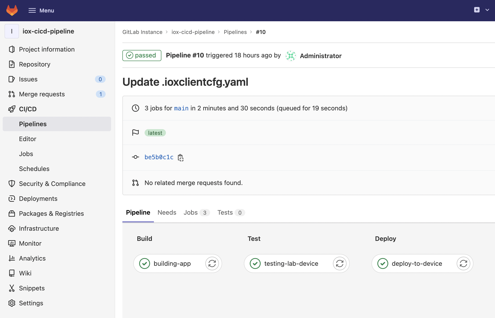

Gitlab CI/CD Pipeline for IOx Applications
=====================================
This is a small example of how an CI/CD pipeline with IOx and Gitlab can look like.

## Related Sandbox

This Sandbox **DOES NOT** feature Gitlab, but Gogs and Drone as an alternative on how to build a CI/CD pipeline for IOx applications.

* [IOx CICD Pipeline 1.11](https://devnetsandbox.cisco.com/RM/Diagram/Index/4d0cb9d9-350c-41fd-b4d2-57090155b069?diagramType=Topology)

## Links to DevNet Learning Labs

This learning lab **DOES NOT** feature Gitlab, but Gogs and Drone as an alternative on how to build a CI/CD pipeline for IOx applications.

* [IOx - Application Deployment and CICD for IoT](https://developer.cisco.com/learning/modules/cicd-iox/)
